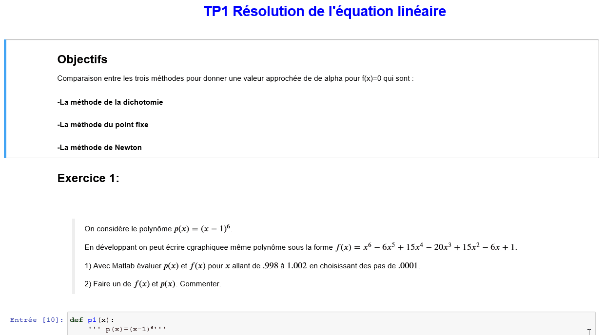

# Binder

<h1>TPs</h1>
- <a href="https://github.com/lindabouallegue/Analyse_Numerique/blob/main/TP1/TP1_E.ipynb">TP1</a> 
- <a href="https://github.com/lindabouallegue/Analyse_Numerique/blob/main/TP2/TP2_E.ipynb">TP2</a> 
- <a href="https://github.com/lindabouallegue/Analyse_Numerique/blob/main/TP3/TP3.ipynb">TP3</a>

<h1 >TP1 Résolution de l'équation linéaire </h1>
<h2>Objectifs</h2>

Comparaison entre les trois méthodes pour donner une valeur approchée de de alpha pour f(x)=0 qui sont :

<h4>-La méthode de la dichotomie </h4>
<h4>-La méthode du point fixe </h4>
<h4>-La méthode de Newton </h4>
<h3>Exercice 1 </h3>
<h3>Exercice 2</h3>
<h3>Exercice 3</h3>
<h3>Exercice 4</h3>
<h2 style="color:#FF0000";>Conclusions</h2>
<h3>La méthode de la dichotomie</h3>

+ L'erreur ne dépend pas de la fonction f

- la méthode de la dichotomie est lente

<h3>La méthode du point fixe</h3>

- La méthode est lente

+ Plus l'ordre de convergence est grand plus la méthode est rapide 

<h3>La méthode de Newton</h3>

+ La méthode de Newton est plus rapide que la méthode de la dichotomie

<h1 >TP2 Interpolation Numérique </h1>
<h2>Objectifs:</h2>

 Dans ce TP nous avons étudié les deux méthodes de l'intérpolation polynomiale qui sont :

- Méthode de Lagrange 

- Méthode de Newton

<h2>Définitions :</h2>

<b>Méthode de Lagrange : </b> 

permet de trouver les points stationnaires (maximum, minimum…) d'une fonction dérivable d'une ou plusieurs variables, sous contraintes.

<b>Méthode de Newton </b>

ne méthode d'interpolation polynomiale permettant d'obtenir le polynôme de Lagrange comme combinaison linéaire de polynômes de la « base newtonienne ».

<h3>Exercice 1</h3>
<h3>Exercice 2</h3>
<h3>Exercice 3</h3>
<h2>Conclusion</h2>

 La méthode de Newton est plus pratique puisque en ajoutant un nouveau point on ne doit pas refaire tout le calcul, nous conservons ce qu'on a obtenu et on termine notre travail. 
  

<h1 >TP3 Mini projet </h1>
<h2>Objectifs:</h2>

 Dans ce TP nous avons étudié les quatre méthodes de l'intégration numérique qui sont :

- Méthode des Trapézes

- Méthode de Simpson

- Méthode des Rectangles

- Méthode de Milieu

<h2>Définitions :</h2>

L'intégration numérique est un chapitre important de l'analyse numérique et un outil indispensable en physique numérique. On intègre numériquement dans deux cas principaux :

- on ne peut pas intégrer analytiquement,
- l'intégrande est fourni non pas sous la forme d'une fonction mais de tableaux de mesures, cas d'ailleurs le plus fréquent dans la vraie vie.
Les méthodes numériques d'intégration d'une fonction sont nombreuses et les techniques très diverses. Des très simples, comme la méthode des rectangles aux très complexes comme certaines variétés de la méthode de Monte-Carlo.

<h3>Méthode des Trapézes</h3>

La méthode d'intégration approchée, dite des trapèzes, décrite ci-après, introduite par Newton & Cotes est plus précise que la méthode élémentaire, dite des rectangles, correspondant aux sommes de Cauchy-Riemann, consistant à remplacer la fonction initiale par une approximation en escalier. Graphiquement, sur l'intervalle [xi, xi+1], on remplace l'arc de courbe par le segment [MiNi+1], donc l'aire sous la courbe, par le « rectangle » xi Mi Ni+1 xi+1 :

 

 
<h3>Méthode de Simpson</h3>

En analyse numérique, la méthode de Simpson, du nom de Thomas Simpson, est une technique de calcul numérique d'une intégrale, c'est-à-dire le calcul approché de :

<h3>Méthode des Rectangles</h3>

Dans cette méthode, on calcule l’intégrale numérique en réalisant une somme de surfaces de rectangles. Le domaine d’intégration est découpé en intervalles et on fait comme si la fonction restait constante sur chaque intervalle.
    

<h3>Méthode de Milieu</h3>

La méthode du point milieu permet d’améliorer sensiblement la vitesse de convergence par rapport
aux rectangles à gauche ou à droite. L’idée est ici de couper à nouveau [a, b] en intervalles de
même longeur.
   

<h2>Conclusion</h2>

 Plus que le nombre de subdivisions augmentent , les valeurs sont plus proches des valeurs exactes.

<h2>Demo</h2>

